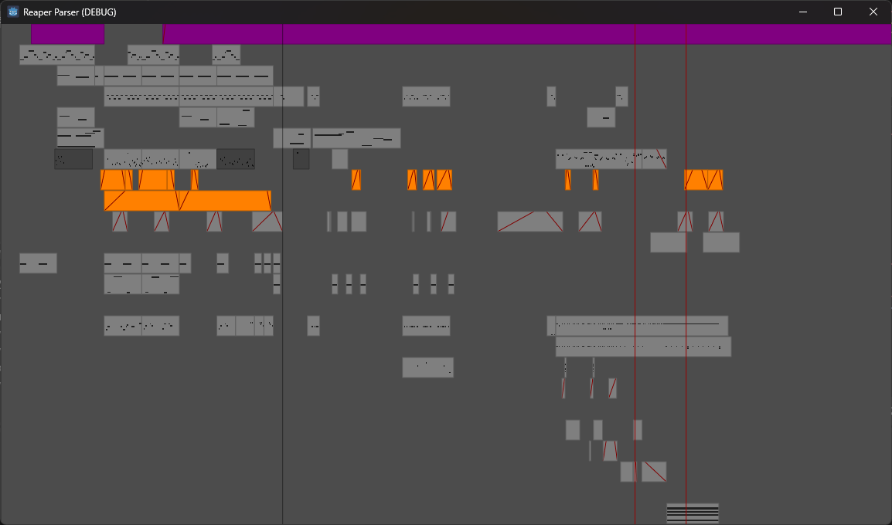

Reaper file parser (.rpp) for Godot Engine 4.6+
===============================================

This is a .rpp project parser written in GDScript.

Does not support everything: a lot of data is skipped. Only what I needed or understood so far is parsed.

Note: the parser is currently written in such a way that if something yet unhandled is encountered, it will throw an error. So some project files may fail to parse. In these cases, the fix is to account for the missing stuff and skip. If its meaning is known, it may eventually be parsed more properly.

Note: this is a random side project, I don't intend to maintain this over a long time.

For details, see `addons/zylann.rpp/rpp_project.gd`.

